# WordPress Author MCP Server

A personality-based Model Context Protocol (MCP) server for WordPress that provides role-appropriate tools for content management. This server enables AI assistants like Claude to create, edit, and manage WordPress content through natural language interactions.

## Purpose & Features

- **🎭 Personality-Based Tool Mapping**: Three modes (Contributor/Author/Administrator) with role-appropriate tools
- **🔧 Semantic Operations**: High-level WordPress actions without API complexity  
- **📁 Document Session Workflow**: Abstracted temp file editing with opaque handles (no filesystem exposure)
- **🔄 Transparent Format Conversion**: AI edits clean Markdown → WordPress receives formatted HTML
- **✏️ Flexible Line-Based Editing**: Precise line operations + contextual search/replace
- **🛡️ WordPress-Native Permissions**: Let WordPress handle all permission enforcement
- **📝 Content Management**: Create drafts, publish posts, schedule content, manage media
- **⚡ Map-Based Architecture**: JSON configuration for tool assignments, no hardcoded roles

## Semantic Architecture

This MCP server is **not just an API wrapper**. It provides intelligent semantic operations that map human workflows to WordPress actions, with sophisticated state management and format conversion.

### Document Session State Flow

```mermaid
flowchart TB
    WP[WordPress HTML Post]:::wordpress
    PFE[pull-for-editing]:::operation
    H2M[HTML→Markdown Conversion]:::converter
    DS[Document Session<br/>Handle: abc123]:::session
    LES[Local Edit State<br/>• Clean Markdown<br/>• Line Numbers<br/>• No HTML Entities]:::state
    
    EDL[edit-document-line]:::edit
    IAL[insert-at-line]:::edit
    SR[search-replace]:::edit
    
    MLS[Modified Local State<br/>Multiple Edits Applied]:::state
    STW[sync-to-wordpress]:::operation
    M2H[Markdown→HTML Conversion]:::converter
    WPU[WordPress Update<br/>Single API Call]:::wordpress
    
    WP -->|1| PFE
    PFE --> H2M
    H2M --> DS
    DS --> LES
    LES --> EDL
    LES --> IAL
    LES --> SR
    EDL --> MLS
    IAL --> MLS
    SR --> MLS
    MLS -->|2| STW
    STW --> M2H
    M2H --> WPU
    
    classDef wordpress fill:#1e40af,stroke:#3730a3,color:#ffffff
    classDef operation fill:#059669,stroke:#047857,color:#ffffff
    classDef converter fill:#7c3aed,stroke:#6d28d9,color:#ffffff
    classDef session fill:#ea580c,stroke:#dc2626,color:#ffffff
    classDef state fill:#0891b2,stroke:#0e7490,color:#ffffff
    classDef edit fill:#64748b,stroke:#475569,color:#ffffff
```



### Semantic Operation Mapping


### Key Architectural Components

1. **Document Session Manager**
   - Maintains editing sessions with opaque handles
   - No filesystem paths exposed to AI
   - Automatic cleanup on sync

2. **Format Conversion Layer**
   - Turndown: HTML → Markdown (with fallbacks)
   - Marked: Markdown → HTML (with fallbacks)
   - Handles WordPress HTML entities transparently

3. **Semantic Operation Engine**
   - Maps high-level intents to WordPress workflows
   - Batches related API calls
   - Provides transaction-like operations

4. **Line-Based Edit System**
   - Precise line number operations
   - Context-aware search within line ranges
   - Avoids brittle string matching

### Permission Flow


## Prerequisites

Before using this MCP server, you need:

1. **WordPress Application Password**
   - Go to your WordPress admin: `Users > Your Profile > Application Passwords`
   - Create a new application password
   - Save this password - you'll need it for setup

2. **WordPress Feature API Plugin**
   - Install the [WordPress Feature API](https://github.com/Automattic/wp-feature-api) plugin
   - Activate the plugin in your WordPress admin
   - This enables semantic operations beyond basic REST API

3. **Appropriate WordPress User Permissions**
   - The MCP server respects your WordPress user's actual permissions
   - Contributor personality + Admin account = Admin capabilities
   - Administrator personality + Contributor account = Contributor capabilities only
   - **WordPress always has final authority on permissions**

## Quick Start

Once prerequisites are met:

```bash
# Clone and install
git clone https://github.com/aaronsb/wordpress-mcp
cd wordpress-mcp
npm install

# Run interactive setup
npm run setup
```

The setup wizard will:
1. Ask for your WordPress site URL and credentials
2. Help you choose a default personality (Contributor/Author/Administrator)
3. Create your `.env` configuration file
4. Generate ready-to-paste configurations for Claude Desktop and Claude Code

**Important**: The personality you choose determines which tools are available, but your actual WordPress user permissions always take precedence.

## Documentation

- **[Architecture Overview](ARCHITECTURE.md)** - Technical details about the semantic operation engine
- **[Customization Guide](CUSTOMIZATION.md)** - Create custom personalities and tool mappings
- **[WordPress MCP Analysis](wordpress-mcp-analysis-report.md)** - Why we built this differently
- **[Test Documentation](tests/README.md)** - Running and understanding the test suite

## How It Works

1. **Features** are defined as standalone modules in `src/features/`
2. **Personalities** map to specific sets of features in `config/personalities.json`
3. **At launch**, specify a personality to expose only its mapped tools
4. **WordPress** handles all actual permission enforcement

## Installation

```bash
git clone https://github.com/aaronsb/wordpress-mcp
cd wordpress-mcp
npm install
```

## Configuration

### 1. WordPress Setup

The server looks for credentials in this order:
1. Environment variables (`WORDPRESS_URL`, `WORDPRESS_USERNAME`, `WORDPRESS_APP_PASSWORD`)
2. `.env` file in `~/.wordpress-mcp/` (recommended for global use)
3. `.env` file in the server directory (for development)

#### Option A: Use the Setup Wizard (Recommended)

Run the interactive setup:
```bash
npm run setup
```

This will:
- Ask where to save your credentials (global or local)
- Collect your WordPress site details
- Create the `.env` file automatically
- Show you ready-to-paste configurations

#### Option B: Manual Setup

Create a `.env` file in `~/.wordpress-mcp/`:

```bash
mkdir -p ~/.wordpress-mcp
cat > ~/.wordpress-mcp/.env << EOF
WORDPRESS_URL=https://your-site.com
WORDPRESS_USERNAME=your-username
WORDPRESS_APP_PASSWORD=your-app-password
EOF
```

**Note**: Use Application Passwords for better security. Generate one at:
`Users > Your Profile > Application Passwords` in your WordPress admin.

### 2. Claude Desktop Setup

First, ensure your credentials are configured (run `npm run setup` if needed).

Add to your Claude Desktop configuration file:

**macOS**: `~/Library/Application Support/Claude/claude_desktop_config.json`
**Windows**: `%APPDATA%\Claude\claude_desktop_config.json`

```json
{
  "mcpServers": {
    "wordpress-author": {
      "command": "node",
      "args": [
        "/path/to/wordpress-mcp/src/server.js",
        "--personality=author"
      ]
    }
  }
}
```

The server will read credentials from its `.env` file.

### 3. Claude Code Setup

#### Option A: Using the CLI (Recommended)

First, ensure your `.env` file is configured (run `npm run setup` if needed).

Then, in your project directory, run:

```bash
claude mcp add wordpress-author \
  node /path/to/wordpress-mcp/src/server.js -- \
  --personality=author
```

The server will read credentials from the `.env` file in the wordpress-mcp directory.

#### Option B: Manual Configuration

Alternatively, add to your project's `.claude/settings.json`:

```json
{
  "mcpServers": {
    "wordpress-author": {
      "command": "node",
      "args": [
        "/path/to/wordpress-mcp/src/server.js",
        "--personality=author"
      ]
    }
  }
}
```

Note: The server reads credentials from its `.env` file, not from the Claude configuration.

**Note**: Adjust the personality parameter (`--personality=`) to one of:
- `contributor` - Limited tools for content creation
- `author` - Full authoring capabilities (recommended)
- `administrator` - Complete site management

## Usage

Once configured, the WordPress tools will be available in Claude. You can:

- Create and edit draft posts
- Publish articles with scheduling options
- **Search posts using natural language**
- **Pull posts for editing with document sessions**
- **Edit content using line-based operations**
- **Sync changes back in single API call**
- Manage media files
- Perform bulk operations (admin only)

### Content Discovery & Editing Workflows

**Semantic Search Examples:**
- "Find my article about potatoes published yesterday"
- "Search for drafts mentioning MCP servers"
- "Show me posts about AI that need editing"
- "Find published articles with comments to review"

**Natural Language Workflows:**
- "Find my article about potatoes and update the cooking section" 
  → AI uses `find-posts` → suggests `pull-for-editing` → guides you through edits
- "Review feedback on my WordPress tutorial"
  → AI searches published posts → uses `view-editorial-feedback`
- "Edit my latest draft about semantic APIs"
  → AI finds recent drafts → pulls for editing → helps with changes

**Direct ID-Based Operations (when you know the ID):**
- "Pull post 42 for editing"
- "Publish draft with ID 30"
- "Schedule post 55 for next Monday at 9 AM"

### Intelligent Search with Intent

The `find-posts` operation understands what you want to do:

**Intent-based filtering:**
- `intent: "edit"` → Prioritizes drafts you can modify
- `intent: "review"` → Shows pending posts awaiting approval  
- `intent: "publish"` → Finds drafts ready to go live
- `intent: "comment"` → Shows published posts with feedback

**Workflow guidance:**
Each search result includes:
- Suggested next actions based on post status
- Clear instructions for the next step
- Role-appropriate tool recommendations

Example:
```
"Find posts about baking I can edit"
→ Returns drafts with suggested actions: ["pull-for-editing", "submit-for-review"]
→ Guidance: "📝 Use 'pull-for-editing' with a post ID to start editing..."
```

### Document Editing Features

**🔄 Transparent Format Conversion:**
- WordPress HTML → Clean Markdown for AI editing
- AI edits in Markdown → WordPress receives formatted HTML
- Preserves **bold**, *italic*, headers, lists, and more
- No HTML entities or encoding issues

**✏️ Flexible Editing Tools:**
- `read-document` - View content with line numbers
- `edit-document-line` - Replace specific lines by number
- `insert-at-line` - Insert content at precise positions
- `replace-lines` - Replace multi-line blocks
- `search-replace` - Context-aware search with line proximity
- `edit-document` - Traditional string replacement (fallback)

### Example Document Session Workflow

```
1. Pull for editing: pull-for-editing postId=42
   → Returns documentHandle="wp-session-abc123" (no filesystem paths!)

2. Read and edit using various methods:
   → read-document documentHandle="wp-session-abc123"
   → edit-document-line lineNumber=5 newLine="Better content"
   → insert-at-line lineNumber=10 content="New paragraph"
   → search-replace searchTerm="old" replacement="new" nearLine=15

3. Sync back:
   → sync-to-wordpress documentHandle="wp-session-abc123"
   → Single WordPress update with all formatting preserved
```

**Key Benefits:**
- AI never sees filesystem paths (security + abstraction)
- Edit in clean Markdown without HTML encoding issues
- WordPress receives properly formatted HTML automatically
- Line-based editing avoids string matching failures
- One pull → multiple edits → one push (API efficiency)

## Personality Mappings

The tool mappings are defined in `config/personalities.json`:

### Contributor

**Content Creation:**
- `draft-article` - Create draft posts
- `edit-draft` - Edit existing drafts
- `submit-for-review` - Submit drafts for editorial review
- `view-editorial-feedback` - See editor comments

**Document Session Workflow:**
- `pull-for-editing` - Fetch posts into editing sessions
- `read-document` - Read documents with line numbers
- `edit-document-line` - Replace specific lines by number
- `insert-at-line` - Insert content at line positions
- `replace-lines` - Replace line ranges
- `search-replace` - Context-aware search and replace
- `edit-document` - String replacement (fallback)
- `sync-to-wordpress` - Push all changes back
- `list-editing-sessions` - View active sessions
- `close-editing-session` - Manual session cleanup

### Author

- All contributor tools, plus:

**Publishing:**
- `create-article` - Create and publish posts immediately
- `publish-workflow` - Publish or schedule posts
- `manage-media` - Upload and manage media files

### Administrator

- All author tools, plus:

**Site Management:**
- `bulk-content-operations` - Bulk actions on posts
- `manage-all-content` - View and manage all posts
- `review-content` - Review pending posts and comments
- `moderate-comments` - Approve, reject, or manage comments
- `manage-categories` - Create, update, and organize categories

## Adding Custom Personalities

Edit `config/personalities.json` to create custom role mappings:

```json
{
  "editor": {
    "name": "Editor",
    "description": "Editorial team member",
    "features": ["manage-all-content", "edit-draft", "publish-workflow", "bulk-content-operations"],
    "context": {
      "can_publish": true,
      "can_edit_others": true
    }
  }
}
```

Then launch with:

```bash
npx wordpress-author-mcp --personality=editor
```

## Customization

See [CUSTOMIZATION.md](CUSTOMIZATION.md) for detailed instructions on:
- Creating custom personalities
- Adding new features
- Configuring role-based tool mappings
- Real-world examples (Editor, Reviewer, Social Media Manager)

## Architecture Benefits

1. **No hardcoded roles** - All personality logic lives in configuration
2. **Easy customization** - Modify JSON to change tool availability
3. **WordPress authority** - The API enforces actual permissions
4. **Clean separation** - Features don't know about personalities
5. **Extensible** - Add features and map them without touching core code

## WordPress Permission Handling

The MCP server presents tools based on personality, but **WordPress always has final authority**:

- If a contributor tries to publish (via API manipulation), WordPress returns 403
- If an author tries to edit others' posts, WordPress denies it
- The MCP server gracefully handles these errors with helpful messages

## Development

```bash
# Run in development mode with auto-reload
npm run dev
```

## License

MIT
