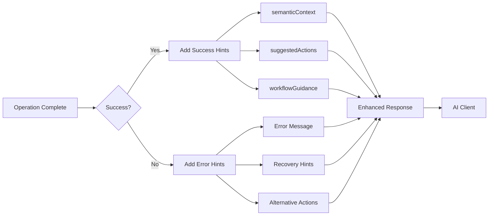
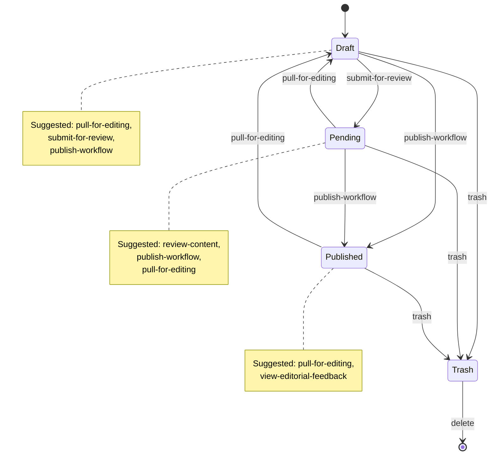
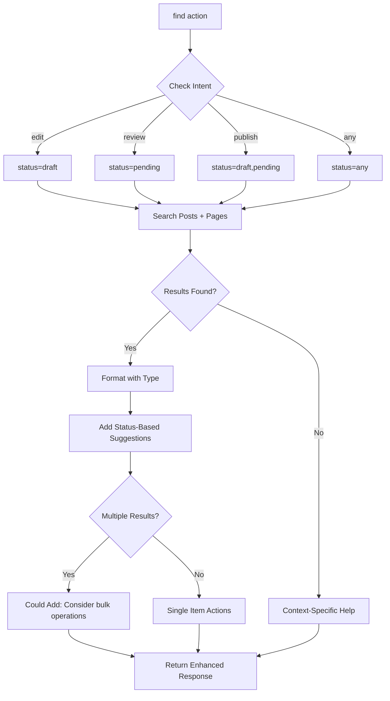
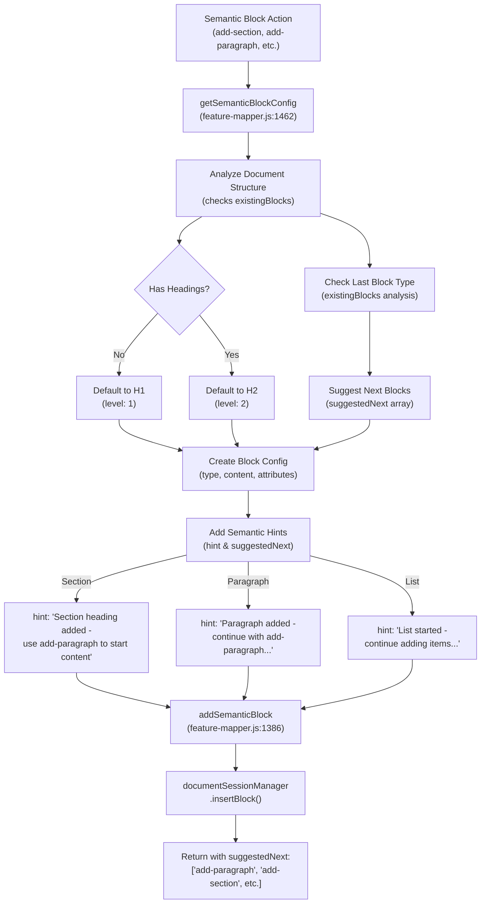

# Semantic Routing Architecture Diagram

## Overview
This diagram shows how requests flow through the WordPress Author MCP server's semantic routing system, including hint generation and suggestion paths.

```mermaid
graph TB
    %% Entry Points
    Client[AI Client/Claude] -->|MCP Protocol| Server["WordPressAuthorMCP<br/>(server.js)"]
    
    %% Server Components
    Server --> PM["PersonalityManager<br/>(personality-manager.js)"]
    Server --> FM["FeatureMapper<br/>(feature-mapper.js)"]
    Server --> TI["ToolInjector<br/>(tool-injector.js)"]
    
    %% Personality-based Filtering
    PM --> |Filters by Role| Tools{5 Semantic Tools}
    
    %% The 5 Main Tools (created in feature-mapper.js)
    Tools --> CM["content-management<br/>(createContentManagementTool)"]
    Tools --> BE["block-editor<br/>(createBlockEditorTool)"]
    Tools --> PW["publishing-workflow<br/>(createPublishingWorkflowTool)"]
    Tools --> MM["media-management<br/>(createMediaManagementTool)"]
    Tools --> SA["site-administration<br/>(createAdminTool)"]
    
    %% Content Management Actions (executeContentAction in feature-mapper.js)
    CM --> |action| CMActions{Content Actions}
    CMActions --> draft["draft<br/>(createDraftArticle)"]
    CMActions --> publish["publish<br/>(publishArticle)"]
    CMActions --> edit["edit<br/>(editDraft)"]
    CMActions --> pull["pull<br/>(pullForEditing)"]
    CMActions --> sync["sync<br/>(syncToWordPress)"]
    CMActions --> trash["trash<br/>(trashContent)"]
    CMActions --> page["page<br/>(createPage)"]
    CMActions --> markdown["markdown-to-wp<br/>(markdownToWordPress)"]
    CMActions --> bulk["bulk<br/>(bulkContentOperations)"]
    
    %% Block Editor Actions (executeBlockAction in feature-mapper.js)
    BE --> |action| BEActions{Block Actions}
    BEActions --> list["list<br/>(listBlocks)"]
    BEActions --> read["read<br/>(readBlock)"]
    BEActions --> editBlock["edit<br/>(editBlock)"]
    BEActions --> insert["insert<br/>(insertBlock)"]
    BEActions --> delete["delete<br/>(deleteBlock)"]
    BEActions --> reorder["reorder<br/>(reorderBlocks)"]
    BEActions --> validate["validate<br/>(validateBlocks)"]
    BEActions --> |Semantic| SemanticBlocks{Semantic Block Actions}
    SemanticBlocks --> addSection["add-section<br/>(addSemanticBlock)"]
    SemanticBlocks --> addParagraph["add-paragraph<br/>(addSemanticBlock)"]
    SemanticBlocks --> addList["add-list<br/>(addSemanticBlock)"]
    SemanticBlocks --> continueWriting["continue-writing<br/>(continueWriting)"]
    
    %% Publishing Workflow Actions (executeWorkflowAction in feature-mapper.js)
    PW --> |action| PWActions{Workflow Actions}
    PWActions --> find["find<br/>(findPostsForWorkflow)"]
    PWActions --> submit["submit<br/>(submitForReview)"]
    PWActions --> publishWF["publish<br/>(publishWorkflow)"]
    PWActions --> feedback["feedback<br/>(viewEditorialFeedback)"]
    
    %% Media Management Actions (executeMediaAction in feature-mapper.js)
    MM --> |action| MMActions{Media Actions}
    MMActions --> upload["upload<br/>(uploadImageFromUrl)"]
    MMActions --> manage["manage<br/>(listMedia)"]
    
    %% Site Administration Actions (executeAdminAction in feature-mapper.js)
    SA --> |action| SAActions{Admin Actions}
    SAActions --> review["review<br/>(reviewContent)"]
    SAActions --> moderate["moderate<br/>(moderateComments)"]
    SAActions --> categories["categories<br/>(manageCategories)"]
    
    %% Semantic Hint Generation
    FM --> |Response Enhancement| SHG["enhanceResponseWithSemantics<br/>(server.js)"]
    
    %% Hint Types
    SHG --> SC[semanticContext]
    SHG --> SA2[suggestedActions]
    SHG --> WG[workflowGuidance]
    SHG --> H[hints]
    
    %% Context-Based Suggestions
    SC --> |Content Type| CTH{Content Type Hints}
    CTH --> PostHint["POST: time-based content<br/>(in pullForEditing)"]
    CTH --> PageHint["PAGE: permanent content<br/>(in pullForEditing)"]
    
    %% Status-Based Suggestions (getSuggestedActions in feature-mapper.js)
    SA2 --> |Post Status| SBS{"Status-Based Suggestions<br/>(getSuggestedActions)"}
    SBS --> DraftActions[draft → pull-for-editing, submit-for-review]
    SBS --> PendingActions[pending → review-content, publish-workflow]
    SBS --> PublishedActions[published → pull-for-editing, view-feedback]
    
    %% Intent-Based Guidance (getWorkflowGuidance in feature-mapper.js)
    WG --> |Search Intent| IBG{"Intent-Based Guidance<br/>(getWorkflowGuidance)"}
    IBG --> EditGuide[edit → Use pull-for-editing...]
    IBG --> ReviewGuide[review → Found posts awaiting...]
    IBG --> PublishGuide[publish → Ready to publish...]
    
    %% Block Operation Flow
    SemanticBlocks --> BSC["getSemanticBlockConfig<br/>(feature-mapper.js)"]
    BSC --> |Analyzes| DocStructure[Document Structure]
    DocStructure --> |Provides| SmartDefaults[Smart Defaults]
    SmartDefaults --> NextBlockSuggestions[Next Block Suggestions]
    
    %% Bulk Operations Flow (in bulkContentOperations)
    bulk --> BulkDetection["Auto-Detect Content Type<br/>(bulkContentOperations)"]
    BulkDetection --> |Checks| PostCheck["wpClient.getPost()"]
    BulkDetection --> |Fallback| PageCheck["wpClient.getPage()"]
    PostCheck --> BulkExecute[Execute Bulk Operation]
    PageCheck --> BulkExecute
    
    %% Error Handling
    CMActions --> |On Error| ErrorHints[Error Recovery Hints]
    BEActions --> |On Error| ErrorHints
    PWActions --> |On Error| ErrorHints
    ErrorHints --> RecoverySuggestions[Recovery Suggestions]
    
    %% Response Flow
    SC --> Response["formatResponse<br/>(server.js)"]
    SA2 --> Response
    WG --> Response
    H --> Response
    ErrorHints --> Response
    Response --> Client
    
    %% WordPress API
    FM --> WPClient["WordPressClient<br/>(wordpress-client.js)"]
    WPClient --> WPAPI[WordPress REST API]
    
    %% Document Session Management
    BE --> DSM["EnhancedDocumentSessionManager<br/>(enhanced-document-session-manager.js)"]
    DSM --> |Manages| Sessions[Active Editing Sessions]
    Sessions --> |Provides| Context[Block Context]
    Context --> BSC
```



## Key Routing Patterns

### 1. Tool Selection Route
```
Client → Server → PersonalityManager → ToolInjector → Selected Tools
```

### 2. Action Execution Route
```
Tool → FeatureMapper → executeXAction() → Specific Implementation
```

### 3. Semantic Enhancement Route
```
Operation Result → enhanceResponseWithSemantics() → Add Hints → Client
```

### 4. Block Editor Semantic Route
```
Block Action → getSemanticBlockConfig() → Analyze Structure → Smart Defaults
```

### 5. Bulk Operation Auto-Detection Route
```
Bulk Request → Try getPost() → Fallback getPage() → Execute Operation
```

## Semantic Hint Flow



## Status-Based Action Suggestions



## Find/Search Routing with Bulk Hints



## Block Editor Semantic Routing



## Method Locations Reference

### Core Files:
- **server.js**: Main server entry, tool registration, response formatting
  - `enhanceResponseWithSemantics()` (line ~126)
  - `getDefaultSuggestionsForGroup()` (line ~162)
  - `formatResponse()` (line ~184)

- **feature-mapper.js**: All action implementations and routing
  - Tool creation methods (lines 43-223)
  - Action execution methods (lines 234-363)
  - Individual feature methods (lines 367-1800+)
  - `getSuggestedActions()` (line ~1733)
  - `getWorkflowGuidance()` (line ~1753)
  - `getSemanticBlockConfig()` (line ~1462)

- **wordpress-client.js**: WordPress API interactions
  - Post/Page CRUD operations
  - Media uploads
  - Category/Tag management

- **enhanced-document-session-manager.js**: Block editing sessions
  - Session management
  - Block operations (insert, edit, delete, reorder)

### Routing Methods in feature-mapper.js:
- `executeContentAction()` (line 234) - Routes content-management actions
- `executeBlockAction()` (line 259) - Routes block-editor actions  
- `executeWorkflowAction()` (line 312) - Routes publishing-workflow actions
- `executeMediaAction()` (line 331) - Routes media-management actions
- `executeAdminAction()` (line 342) - Routes site-administration actions